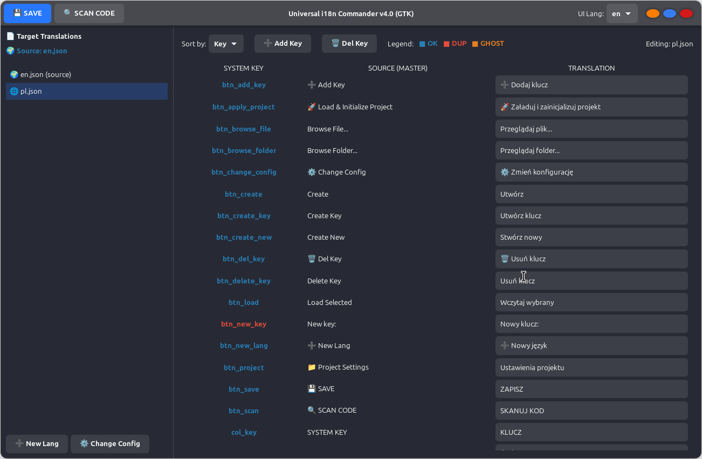

# 🌍 Universal i18n Commander (UniC)



**Universal i18n Commander** is a lightweight localization manager for JSON-based projects. It streamlines translation maintenance, detects unused keys, and helps keep your localization files synchronized with source code.

### 🚀 Why UniC?

- **GTK4 UI:** The current stable release uses GTK4 via PyGObject for a modern desktop interface.
- **Code-Aware:** Scans your source code in real time to show which keys are actually in use.
- **JSON-Native UI:** The application's interface is localized via its own JSON resource files.

### ✨ Key Features

- 🔍 **Smart Scanning:** Automatically detects key usage across your project.
- 🎨 **Status Legend:**
  - 🔵 **Blue (OK):** Key is present in JSON and active in the code.
  - 🟠 **Orange (Ghost Key):** Key exists in JSON but was not found in the source code.
  - 🔴 **Red (Duplicate):** Multiple keys share the same value.
- 📋 **Click-to-Inspect:** Copy keys instantly and see their locations in the code.
- 🔄 **Dynamic UI Language:** Change the interface language on the fly.

### 🧩 Requirements

- Python 3.10+ (recommended 3.12)
- GTK 4 runtime
- PyGObject bindings for GTK4 (`python3-gi` / `PyGObject`)

### 🛠 Installation & Usage

1. Clone the repository or download the latest version from the **Releases** section.
2. Install GTK4 and PyGObject on your system. For example on Debian/Ubuntu:
   ```bash
   sudo apt install python3-gi gir1.2-gtk-4.0
   ```
3. Run from source:
   ```bash
   python3 src/UniC.py
   ```

### ℹ️ Notes

- The GTK4 UI depends on `src/internal_lang/en.json` as an internal UI language resource.
- Stability tests are included in `tests/test_scan.py` and verify key scanning plus propagation behavior.
